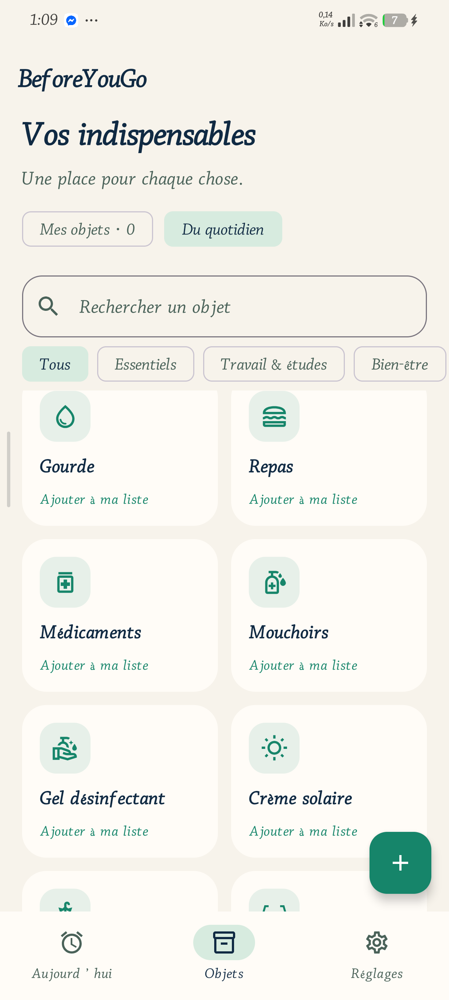

# BeforeYouGo

**A calm, personal departure routine for Android.**

BeforeYouGo helps people prepare the things they need before leaving home. Build a visual list of everyday essentials, create routines for work, school, sport, travel, or family life, and choose whether each routine should ring like an alarm or arrive as a quiet notification.

The app is offline-first: it has no account, no ads, no analytics, and no network dependency.

<p align="center">
  
</p>

## Product highlights

- Create as many departure routines as you need.
- Choose a name, time, and any combination of weekdays for every routine.
- Select one of two delivery modes per routine:
  - **Ring** plays an Android alarm sound, can vibrate, and offers Stop and Snooze controls.
  - **Notification** sends a quiet reminder with Open and Snooze actions, without starting an alarm sound.
- Pick an Android alarm sound, enable or disable vibration, and choose a 5, 10, or 15 minute snooze duration.
- Select a routine-specific checklist or include all items that are due that day.
- Skip only the next occurrence without disabling the recurring routine.
- Browse and search 36 illustrated suggestions, grouped into Essentials, Work & Study, Well-being, Outings & Travel, and Sport & Family.
- Create one-off items with a date, or recurring everyday items.
- Use light, dark, or system-following appearance.
- Recover scheduled routines after a reboot, app update, time change, or time-zone change.

## How it works

1. Open **Objects**. Add an item with the `+` button, or pick from **Everyday** suggestions.
2. Open **Today** and select **Create alarm**.
3. Name the routine, set its time, select weekdays, then choose **Ring** or **Notification**.
4. Configure sound, vibration, snooze, and the checklist for that specific routine.
5. In **Settings**, allow notifications and Android’s exact alarm access. The app clearly shows when either permission is missing.

An alarm sound automatically stops after two minutes. A sound preview lasts ten seconds. Quiet notification routines never start media playback or app-controlled vibration.

## Visual design

The interface uses a focused departure-ritual design: ink blue for time-critical information, jade for completion and primary actions, warm paper surfaces, and compact visual object cards. Icons are Material vectors, so they stay sharp at every Android density and work offline.

The catalogue screenshot above was captured from the Android build on a physical device. It is intentionally a real product screenshot rather than a mocked marketing image.

## Technical overview

| Area | Implementation |
| --- | --- |
| UI | Kotlin, Jetpack Compose, Material 3 |
| Storage | Local `SharedPreferences` JSON; no backend or account |
| Scheduling | `AlarmManager.setAlarmClock()` with exact-alarm access checked at runtime |
| Ring mode | Short-lived foreground media playback service, alarm audio focus, vibration, wake lock, and auto-stop |
| Notification mode | Quiet local notification with Open and Snooze actions |
| Reliability | Re-schedules after boot, package replacement, time changes, time-zone changes, and exact-alarm access changes |
| Minimum Android version | Android 8.0 / API 26 |
| Target SDK | API 37 |

## Run locally

### Requirements

- Android Studio or a compatible Android SDK installation
- JDK 11 or newer
- An Android 8.0+ device or emulator

### Build and install

```powershell
.\gradlew.bat assembleDebug
```

The debug APK is created at `app/build/outputs/apk/debug/app-debug.apk`.

With a USB-debugging device connected:

```powershell
adb install -r app/build/outputs/apk/debug/app-debug.apk
adb shell am start -n com.toaandri.beforeyougo/.MainActivity
```

### Verify

```powershell
.\gradlew.bat testDebugUnitTest lintDebug
.\gradlew.bat assembleDebugAndroidTest
```

The unit suite covers recurring schedules, skipped occurrences, custom checklists, daylight-saving transitions, and routine storage migration. Instrumented tests also cover alarm audio start/stop/snooze behaviour on a real device.

Avoid Gradle’s `connectedDebugAndroidTest` on a personal device with irreplaceable local data: some device-specific test runners uninstall the target application before testing. Install the debug and test APKs with `adb install -r` / `adb install -r -t` and run only the required instrumentation class instead.

## Privacy

BeforeYouGo does not create accounts, send analytics, show ads, or use a server. Lists, routines, preferences, and completion states are stored only on the device. Android cloud backup and device-transfer backup are excluded for the app’s shared preferences.

When a user enables a routine, the app may request notifications and Android’s exact-alarm special access. These are used only to deliver the selected local Ring or Notification routine. Users can revoke permissions or disable any routine at any time.

## Current scope

BeforeYouGo does not currently provide sync, widgets, exports, cloud backup, shared lists, or automatic physical-object detection. Completion state is shared by an object across the day’s applicable checklists.

## License

No open-source license has been selected yet. The repository contents are not automatically licensed for reuse.
